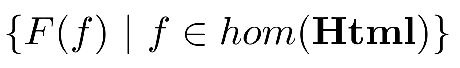
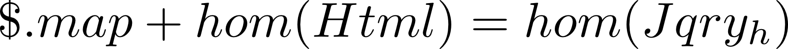
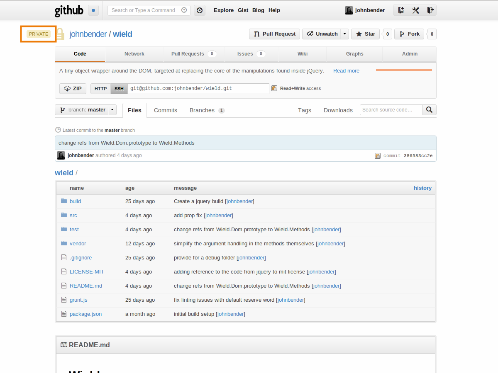
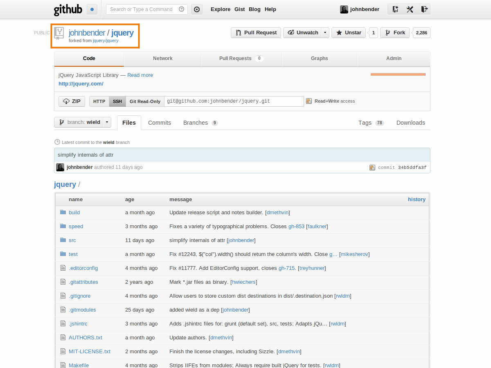

!SLIDE link center background-image fast-background
<h1 style="font-size: 7em">
  Faster jQuery
  <!-- oh noes div inside h1 :P -->
  
with

  Category Theory
</h1>
johnbender.us/presentation-faster-js

!SLIDE bullets mono-bullets
* @johnbender
* johnbender.us
* github.com/johnbender

!SLIDE center adobe-background background-image
## jquery mobile

!SLIDE center background-image motivated-background
# motivation

!SLIDE center awesome-background background-image
<h2 class="over-image" style="margin-top: 35%;">math: it's great</h2>

!SLIDE image center stats-background background-image
<h2 class="over-image" style="margin-top: 35%;">jquery: it's popular</h2>

!SLIDE center speed-background background-image
<h2 class="over-image" style="margin-top: 35%;">speed: it's sexy</h2>

!SLIDE center background-image jquery-background
## jquery

!SLIDE xsmall
    @@@ javascript
    // {jQuery}
    $( "div" );

!SLIDE xsmall
    @@@ javascript
    // {jQuery}
    $( "div" ).foo();

!SLIDE xsmall
    @@@ javascript
    // {jQuery}
    $( "div" ).foo().bar();

!SLIDE
    @@@ javascript
    // @returns {jQuery}
    jQuery.fn.foo = function() {
      // manipulate this
      return this;
    };

!SLIDE
    @@@ javascript
    // @returns {jQuery}
    jQuery.fn.~~~foo/~~~ = function() {
      // manipulate this
      return this;
    };

!SLIDE
    @@@ javascript
    // @returns {jQuery}
    ~~~jQuery.fn/~~~.foo = function() {
      // manipulate this
      return this;
    };

!SLIDE
    @@@ javascript
    // @returns {jQuery}
    jQuery.fn.foo = function() {
      // manipulate this
      return ~~~this/~~~;
    };

!SLIDE
    @@@ javascript
    // @returns {jQuery}
    jQuery.fn.foo = function() {
      ~~~// manipulate this/~~~
      return this;
    };

!SLIDE medium
    @@@ javascript
    // @returns {jQuery}
    jQuery.fn.foo = function( a, b ) {
      this.map(function( i, elem ) {
        // alter the HTMLElement
      });

      return this;
    };

!SLIDE medium
    @@@ javascript
    // @returns {jQuery}
    jQuery.fn.foo = function( ~~~a, b/~~~ ) {
      this.map(function( i, elem ) {
        // alter the HTMLElement
      });

      return this;
    };

!SLIDE medium
    @@@ javascript
    // @returns {jQuery}
    jQuery.fn.foo = function( a, b ) {
      this.~~~map/~~~(function( i, elem ) {
        // alter the HTMLElement
      });

      return this;
    };

!SLIDE medium
    @@@ javascript
    // @returns {jQuery}
    jQuery.fn.foo = function( a, b ) {
      this.map(function( i, elem ) {
        ~~~// alter the HTMLElement/~~~
      });

      return this;
    };

!SLIDE medium
    @@@ javascript
    // @returns {jQuery}
    jQuery.fn.foo = function( a, b ) {
      this.map(function( i, elem ) {
        // alter the HTMLElement
      });

      return this;
    };

☹

!SLIDE center background-image math-background
# category Theory

!SLIDE center background-image e-ml-background
<h2 class="over-image"  style="margin-top: 35%;">context: it's useful</h2>

!SLIDE center background-image e-ml-background
<h2 class="over-image names" style="margin-top: 35%;">
  Eilenberg
  Mac Lane
</h2>

!SLIDE center background-image e-ml-silly-background
<h2 class="over-image names" style="margin-top: 35%;">
  Eilenberg
  Mac Lane
</h2>

!SLIDE center background-image category-background
## category

!SLIDE center image
</img>

!SLIDE center image
</img>

!SLIDE
<pre class="xxsmall">
function id( a ) {
  return a;
}
</pre>

!SLIDE center image
</img>

!SLIDE
<pre class="xsmall">
function cmps( f, g ) {
  return function( a ) {
    return f(g(a));
  };
}
</pre>

!SLIDE
<pre class="xsmall">
function cmps( <b>f, g</b> ) {
  return function( a ) {
    return f(g(a));
  };
}
</pre>

!SLIDE
<pre class="xsmall">
function cmps( f, g ) {
  return function( <b>a</b> ) {
    return f(g(<b>a</b>));
  };
}
</pre>

!SLIDE
<pre class="xsmall">
function cmps( f, g ) {
  return function( a ) {
    return f(<b>g(a)</b>);
  };
}
</pre>

!SLIDE
<pre class="xsmall">
function cmps( f, g ) {
  return function( a ) {
    return <b>f(g(a))</b>;
  };
}
</pre>

!SLIDE center background-image html-background
## Html

!SLIDE center image
</img>

!SLIDE medium
    @@@javascript
    // {HTMLElement}
    document.querySelector( "#sample" );

!SLIDE center image
</img>

!SLIDE
<pre>
// @param {HTMLElement} elem
// @returns {HTMLElement}
function( elem ) {
  return elem;
};

</pre>

!SLIDE
<pre>
// @param {HTMLElement} elem
// @returns {HTMLElement}
function setFoo( elem ) {
  elem.setAttribute( "class", "foo" );
  return elem;
}
</pre>

!SLIDE center image
</img>

!SLIDE
<pre class="xsmall">
function id( a ) {
  return a;
}
</pre>

!SLIDE
<pre class="xsmall">
function id( <b>a</b> ) {
  return <b>a</b>;
}
</pre>

!SLIDE
<pre class="xsmall">
function id( <b>elem</b> ) {
  return <b>elem</b>;
}
</pre>

!SLIDE center image
</img>

!SLIDE
<pre class="xsmall">
function cmps( f, g ) {
  return function(a) {
    return f(g(a));
  };
}
</pre>

!SLIDE
<pre class="xsmall">
function cmps( f, g ) {
  return function(<b>a</b>) {
    return f(g(<b>a</b>));
  };
}
</pre>

!SLIDE
<pre class="xsmall">
function cmps( f, g ) {
  return function(<b>elem</b>) {
    return f(g(<b>elem</b>));
  };
}
</pre>

!SLIDE center background-image jquery-background
## Jqry

!SLIDE center image
</img>

!SLIDE
<pre class="xsmall">
// {jQuery}
$( "#sample" );
</pre>

!SLIDE center image
</img>

!SLIDE
<pre class="xsmall">
// {jQuery}
$( "#sample" )<b>.hide();</b>
</pre>

!SLIDE center image
</img>

!SLIDE
<pre class="small">
// @returns {jQuery}
jQuery.fn.id = function() {
  return this;
};
</pre>

!SLIDE
<pre class="small">
// @returns {jQuery}
<b>jQuery.fn</b>.id = function() {
  return this;
};
</pre>

!SLIDE
<pre class="small">
// @returns {jQuery}
jQuery.fn.id = function() {
  return <b>this</b>;
};
</pre>

!SLIDE xsmall
    @@@ javascript
    // {jQuery}
    $( "#sample" ).id();

!SLIDE xsmall
    @@@ javascript
    // {jQuery}
    $( "#sample" ).~~~id()/~~~;

!SLIDE xsmall
    @@@ javascript
    // {jQuery}
    ~~~$( "#sample" )/~~~.id();

!SLIDE center image
</img>

!SLIDE
<pre style="font-size: 3.6em;">
jQuery.cmps = function( f, g ) {
  return function() {
    return f.apply(g.apply(this));
  };
};
</pre>

!SLIDE
<pre style="font-size: 3.6em;">
jQuery.cmps = function( <b>f, g</b> ) {
  return function() {
    return f.apply(g.apply(this));
  };
};
</pre>

!SLIDE
<pre style="font-size: 3.6em;">
jQuery.cmps = function( f, g ) {
  return function() {
    return f.apply(g.apply(<b>this</b>));
  };
};
</pre>

!SLIDE
<pre style="font-size: 3.6em;">
jQuery.cmps = function( f, g ) {
  return function() {
    return f.apply(<b>g.apply(this)</b>);
  };
};
</pre>

!SLIDE
<pre style="font-size: 3.6em;">
jQuery.cmps = function( f, g ) {
  return function() {
    return <b>f.apply(g.apply(this))</b>;
  };
};
</pre>

!SLIDE
<pre>
// @returns {jQuery}
jQuery.fn.g = function() {
  // manipulate `this`
  return this;
};

// @returns {jQuery}
jQuery.fn.f = function(){
  // manipulate `this`
  return this;
};
</pre>

!SLIDE
<pre>
// @returns {jQuery}
<b>jQuery.fn.g</b> = function() {
  // manipulate `this`
  return this;
};

// @returns {jQuery}
<b>jQuery.fn.f</b> = function(){
  // manipulate `this`
  return this;
};
</pre>

!SLIDE
<pre>
// @returns {jQuery}
jQuery.fn.g = function() {
  // manipulate `this`
  return <b>this</b>;
};

// @returns {jQuery}
jQuery.fn.f = function(){
  // manipulate `this`
  return <b>this</b>;
};
</pre>

!SLIDE
<pre>
// @returns {jQuery}
jQuery.fn.gf = jQuery.cmps(
  jQuery.fn.f,
  jQuery.fn.g
);

// {jQuery}
$( "#sample" ).g().f();

// {jQuery}
$( "#sample" ).gf();
</pre>

!SLIDE
<pre>
// @returns {jQuery}
jQuery.fn.gf = jQuery.cmps(
  <b>jQuery.fn.f,</b>
  <b>jQuery.fn.g</b>
);

// {jQuery}
$( "#sample" ).g().f();

// {jQuery}
$( "#sample" ).gf();
</pre>

!SLIDE
<pre>
// @returns {jQuery}
jQuery.fn.<b>gf</b> = jQuery.cmps(
  jQuery.fn.f,
  jQuery.fn.g
);

// {jQuery}
$( "#sample" ).g().f();

// {jQuery}
$( "#sample" ).gf();
</pre>

!SLIDE
<pre>
// @returns {jQuery}
jQuery.fn.gf = jQuery.cmps(
  jQuery.fn.f,
  jQuery.fn.g
);

// {jQuery}
$( "#sample" ).g().f();

// {jQuery}
$( "#sample" ).gf();
</pre>

!SLIDE
<pre>
// @returns {jQuery}
jQuery.fn.gf = jQuery.cmps(
  jQuery.fn.f,
  jQuery.fn.g
);

// {jQuery}
$( "#sample" )<b>.g().f()</b>;

// {jQuery}
$( "#sample" )<b>.gf()</b>;
</pre>

!SLIDE center background-image horror-background
## functor

!SLIDE center image
</img>

!SLIDE center image
</img>

!SLIDE center image
</img>

!SLIDE
<pre>
// {HTMLDivElement}
document.querySelector( "div" );

// {jQuery}
$( document.querySelector("div") );
</pre>

!SLIDE
<pre>
// {HTMLDivElement}
document.querySelector( "div" );

// {jQuery}
$( <b>document.querySelector("div")</b> );
</pre>

!SLIDE center image
</img>

!SLIDE
<pre>
// @param {HTMLElement} elem
// @returns {HTMLElement}
function setFoo( elem ) {
  elem.setAttribute( "class", "foo" );
  return elem;
}
</pre>

!SLIDE
<pre class="xsmall">
// {HTMLDivElement}
setFoo( sample );

// {jQuery}
$( "#sample" ).setFoo();
</pre>

!SLIDE
<pre class="xsmall">
// {HTMLDivElement}
<b>setFoo( sample );</b>

// {jQuery}
$( "#sample" ).setFoo();
</pre>

!SLIDE
<pre class="xsmall">
// {HTMLDivElement}
setFoo( sample );

// {jQuery}
<b>$( "#sample" ).setFoo();</b>
</pre>

!SLIDE
<pre>
jQuery.fn.setFoo = function() {
  this.map(function setFoo( i, elem ) {
    elem.setAttribute( "class", "foo" );
    return elem;
  });
};
</pre>

!SLIDE
<pre>
jQuery.fn.setFoo = function() {
  <b>this</b>.map(function setFoo( i, elem ) {
    elem.setAttribute( "class", "foo" );
    return elem;
  });
};
</pre>

!SLIDE
<pre>
jQuery.fn.setFoo = function() {
  this.<b>map</b>(function setFoo( i, elem ) {
    elem.setAttribute( "class", "foo" );
    return elem;
  });
};
</pre>

!SLIDE
<pre>
jQuery.fn.setFoo = function() {
  this.map(function <b>setFoo</b>( i, elem ) {
    elem.setAttribute( "class", "foo" );
    return elem;
  });
};
</pre>

!SLIDE
<pre>
jQuery.fn.setFoo = function() {
  <b>this.map</b>(function setFoo( i, elem ) {
    elem.setAttribute( "class", "foo" );
    return elem;
  });
};
</pre>

!SLIDE center image
</img>

!SLIDE center image
</img>

!SLIDE
<pre>
jQuery.fn.gf = jQuery.cmps(
  jQuery.fn.f,
  jQuery.fn.g
);

// use the map in f,g then compose
$( "div" ).gf();

// compose first then use map
$( "div" ).map( cmps(f, g) );
</pre>

!SLIDE
<pre>
jQuery.fn.gf = jQuery.cmps(
  <b>jQuery.fn.f,</b>
  <b>jQuery.fn.g</b>
);

// use the map in f,g then compose
$( "div" ).gf();

// compose first then use map
$( "div" ).map( cmps(f, g) );
</pre>

!SLIDE
<pre>
jQuery.fn.<b>gf</b> = jQuery.cmps(
  jQuery.fn.f,
  jQuery.fn.g
);

// use the map in f,g then compose
$( "div" ).gf();

// compose first then use map
$( "div" ).map( cmps(f, g) );
</pre>

!SLIDE
<pre>
jQuery.fn.gf = jQuery.cmps(
  jQuery.fn.f,
  jQuery.fn.g
);

// use the map in f,g then compose
$( "div" )<b>.gf();</b>

// compose first then use map
$( "div" ).map( cmps(f, g) );
</pre>

!SLIDE
<pre>
jQuery.fn.gf = jQuery.cmps(
  jQuery.fn.f,
  jQuery.fn.g
);

// use the map in f,g then compose
$( "div" )<b>.g().f();</b>

// compose first then use map
$( "div" ).map( cmps(f, g) );
</pre>

!SLIDE
<pre>
jQuery.fn.gf = jQuery.cmps(
  jQuery.fn.f,
  jQuery.fn.g
);

// use the map in f,g then compose
$( "div" )<b>.g().f();</b>

// compose first then use map
$( "div" )<b>.map( cmps(f, g) );</b>
</pre>

!SLIDE center background-image hug-background
## Html ♥ Jqry

!SLIDE center image
</img>

!SLIDE center image
</img>

!SLIDE center image
</img>

!SLIDE center image
</img>

!SLIDE medium
    @@@ javascript
    // @returns {jQuery}
    jQuery.fn.foo = function( a, b ) {
      this.map(function( i, elem ) {
        // alter the HTMLElement
      });

      return this;
    };

!SLIDE medium
    @@@ javascript
    // @returns {jQuery}
    ~~~jQuery.fn.foo/~~~ = function( a, b ) {
      this.map(function( i, elem ) {
        // alter the HTMLElement
      });

      return this;
    };

!SLIDE medium
    @@@ javascript
    // @returns {jQuery}
    jQuery.fn.foo = function( a, b ) {
      this.~~~map/~~~(function( i, elem ) {
        // alter the HTMLElement
      });

      return this;
    };

!SLIDE medium
    @@@ javascript
    // @returns {jQuery}
    jQuery.fn.foo = function( a, b ) {
      this.map(function( i, elem ) {
        ~~~// alter the HTMLElement/~~~
      });

      return this;
    };

!SLIDE
<table>
  <tr>
		<td>addClass</td>
		<td>after</td>
		<td class="last">append</td>
	</tr>
  <tr>
		<td>appendTo</td>
		<td>attr</td>
		<td class="last">before</td>
	</tr>
  <tr>
		<td>empty</td>
		<td>html</td>
		<td class="last">prepend</td>
	</tr>
  <tr>
		<td>prependTo</td>
		<td>prop</td>
		<td class="last">remove</td>
	</tr>
  <tr>
		<td>text</td>
		<td>unwrap</td>
		<td class="last">val</td>
	</tr>
  <tr>
		<td>width</td>
		<td>wrap</td>
		<td class="last">wrapAll</td>
	</tr>
</table>

!SLIDE medium
    @@@ javascript
    // @returns {jQuery}
    jQuery.fn.foo = function( a, b ) {
      this.map(function( i, elem ) {
        // alter the HTMLElement
      });

      return this;
    };

!SLIDE medium
    @@@ javascript
    // @returns {jQuery}
    jQuery.fn.foo = function( ~~~a, b/~~~ ) {
      this.~~~map/~~~(function( i, elem ) {
        ~~~// alter the HTMLElement/~~~
      });

      return this;
    };

!SLIDE medium
    @@@ javascript
    // @returns {jQuery}
    jQuery.fn.foo = function( a, b ) {
      this.map(function( i, elem ) {
        // alter the HTMLElement
      });

      return this;
    };

☹

!SLIDE center image
</img>

!SLIDE
    @@@ javascript
    // @returns {HTMLElement}
    function foo( i, elem ) {
      // alter the HTMLElement
      return elem;
    }

!SLIDE
    @@@ javascript
    // @returns {HTMLElement}
    function foo( i, ~~~elem/~~~ ) {
      // alter the HTMLElement
      return ~~~elem/~~~;
    }

!SLIDE medium
    @@@ javascript
    // @returns {jQuery}
    jQuery.fn.foo = function( a, b ) {
      this.map(foo);
      return this;
    };

!SLIDE medium
    @@@ javascript
    // @returns {jQuery}
    jQuery.fn.foo = function( ~~~a, b/~~~ ) {
      this.map(foo);
      return this;
    };

!SLIDE medium
    @@@ javascript
    // @returns {jQuery}
    jQuery.fn.foo = function( a, b ) {
      ~~~this.map/~~~(foo);
      return this;
    };

!SLIDE medium
    @@@ javascript
    // @returns {jQuery}
    jQuery.fn.foo = function( a, b ) {
      this.map(~~~foo/~~~);
      return this;
    };

!SLIDE medium
    @@@ javascript
    // @returns {jQuery}
    jQuery.fn.foo = function( a, b ) {
      this.map(foo);
      return this;
    };

☺

!SLIDE center background-image fist-bump-background
<h1 style="margin-top: 40%; opacity: 0.88">upshot</h1>

!SLIDE center background-image wrap-background
## rewrap

!SLIDE medium
    @@@ javascript
    // @returns {jQuery}
    $( "a" ).click(function( event ) {
      // invoke foo on click target
      $( event.target ).foo();
    });

!SLIDE medium
    @@@ javascript
    // @returns {jQuery}
    $( "a" ).click(function( event ) {
      // invoke foo on click target
      $( ~~~event.target/~~~ ).foo();
    });

!SLIDE medium
    @@@ javascript
    // @returns {jQuery}
    $( "a" ).click(function( event ) {
      // invoke foo on click target
      $( event.target ).~~~foo()/~~~;
    });

!SLIDE medium
    @@@ javascript
    // @returns {jQuery}
    $( "a" ).click(function( event ) {
      // invoke foo on click target
      foo( event.target );
    });

!SLIDE center background-image fusion-background
## fusion

!SLIDE center image
</img>

!SLIDE medium
    @@@ javascript
    // two loops with chaining
    $( "div" )
      .removeAttr( "foo" )
      .removeAttr( "bar" );

!SLIDE medium
    @@@ javascript
    // two loops with chaining
    $( "div" )
      ~~~.removeAttr( "foo" )/~~~
      ~~~.removeAttr( "bar" );/~~~

!SLIDE medium
    @@@ javascript
    // single loop with html morphism
    $( "div" ).each(function( i, elem ) {
      removeAttr( elem, "foo" );
      removeAttr( elem, "bar" );
    });

!SLIDE medium
    @@@ javascript
    // single loop with html morphism
    $( "div" ).each(function( i, elem ) {
      ~~~removeAttr( elem, "foo" );/~~~
      ~~~removeAttr( elem, "bar" );/~~~
    });

!SLIDE image

<code>$( "div" ).removeAttr( "foo" ).removeAttr( "bar" );</code>

</img>

!SLIDE center background-image invocation-background
## invocation

!SLIDE
    @@@ javascript
    // chained
    $( "div" )
      .removeAttr( "foo" )
      .removeAttr( "bar" );

!SLIDE
    @@@ javascript
    // string parsing
    $( "div" )
      .removeAttr( "foo bar" );

!SLIDE image

<code>$( "div" ).removeAttr( "foo" ).removeAttr( "bar" );</code>

</img>

!SLIDE center background-image dogfood-background
## dogfood

!SLIDE large
    @@@ javascript
    function replaceWith( e, val ) {
      if ( e.nextSibling ) {
        before( e.nextSibling, value );
      } else {
        append( e.parentNode, value );
      }

      remove( e );
    }

!SLIDE large
    @@@ javascript
    function replaceWith( e, val ) {
      if ( e.nextSibling ) {
        ~~~before( e.nextSibling, value )/~~~;
      } else {
        append( e.parentNode, value );
      }

      ~~~remove( e )/~~~;
    }

!SLIDE large
    @@@ javascript
    function replaceWith( e, val ) {
      if ( e.nextSibling ) {
        before( e.nextSibling, value );
      } else {
        ~~~append( e.parentNode, value )/~~~;
      }

      ~~~remove( e )/~~~;
    }

!SLIDE image

<code>$( ".test" ).replaceWith( "&lt;div&gt;&lt;/div&gt;" );</code>

</img>

!SLIDE center background-image core-background
## core

!SLIDE large
    @@@ javascript
    // jQuery 1.8
    var a = document.createElement( "div" );

    // Timed operation
    $( ".test" ).append( a );

!SLIDE large
    @@@ javascript
    // jQuery 1.8
    var a = document.createElement( "div" );

    // Timed operation
    ~~~$( ".test" ).append( a );/~~~

!SLIDE large
    @@@ javascript
    // Abstracted Core 1.8
    var set = $( ".test" ), l, a;

    l = set.length;
    a = document.createElement( "div" );

    // Timed operation
    while( l-- ) { append( set[l], a ); }

!SLIDE large
    @@@ javascript
    // Abstracted Core 1.8
    var set = $( ".test" ), l, a;

    l = set.length;
    a = document.createElement( "div" );

    // Timed operation
    while( l-- ) { ~~~append( set[l], a );/~~~ }

!SLIDE large
    @@@ javascript
    // Abstracted Core 1.8
    var set = $( ".test" ), l, a;

    l = set.length;
    a = document.createElement( "div" );

    // Timed operation
    while( l-- ) { append( ~~~set[l]/~~~, a ); }

!SLIDE
!SLIDE image

<code>jQuery.fn.append vs while(){ jQuery.append } </code>

</img>

!SLIDE center background-image dual-wield-background
<h1 style="margin-top: 30%; opacity: 0.9">wield</wield>

!SLIDE image center full

!SLIDE image center full

!SLIDE center background-image focus-background
## focused

!SLIDE large
    @@@ javascript
    function empty( e ) {
      // remove all child nodes
      while ( e.firstChild ) {
        e.removeChild( e.firstChild );
      }

      return e;
    };

!SLIDE large
    @@@ javascript
    function empty( e ) {
      // remove all child nodes
      while ( e.firstChild ) {
        e.removeChild( e.firstChild );
      }

      ~~~return e;/~~~
    };

!SLIDE center background-image functional-background
## functional

!SLIDE medium
    @@@ javascript
    // standalone
    Wield.Methods.empty( elem );

    // or as an instantiated object
    var wield = Wield.Dom( elem );

    // chains supported
    wield.empty().empty();

    // or as a selected object
    Wield.Dom.find( "#sample" ).empty();

!SLIDE medium
    @@@ javascript
    // standalone
    ~~~Wield.Methods.empty( elem );/~~~

    // or as an instantiated object
    var wield = Wield.Dom( elem );

    // chains supported
    wield.empty().empty();

    // or as a selected object
    Wield.Dom.find( "#sample" ).empty();

!SLIDE medium
    @@@ javascript
    // standalone
    Wield.Methods.empty( elem );

    // or as an instantiated object
    var wield = ~~~Wield.Dom( elem );/~~~

    // chains supported
    wield.empty().empty();

    // or as a selected object
    Wield.Dom.find( "#sample" ).empty();

!SLIDE medium
    @@@ javascript
    // standalone
    Wield.Methods.empty( elem );

    // or as an instantiated object
    var wield = Wield.Dom( elem );

    // chains supported
    ~~~wield.empty().empty();/~~~

    // or as a selected object
    Wield.Dom.find( "#sample" ).empty();

!SLIDE medium
    @@@ javascript
    // standalone
    Wield.Methods.empty( elem );

    // or as an instantiated object
    var wield = Wield.Dom( elem );

    // chains supported
    wield.empty().empty();

    // or as a selected object
    ~~~Wield.Dom.find( "#sample" ).empty();/~~~

!SLIDE center background-image modular-background
## modular

!SLIDE bash
    @@@ bash
    ~~~*wield/*~~~ ~~~@master/@~~~ ⎇  ls src/methods/
    after.js   before.js  prepend.js   replacewith.js
    all.js     empty.js   prop.fix.js  text.js
    append.js  html.js    prop.js      unwrap.js
    attr.js    misc.js    remove.js    wrap.js

!SLIDE bash
    @@@ bash
    ~~~*wield/*~~~ ~~~@master/@~~~ ⎇  ls src/methods/
    after.js   before.js  prepend.js   replacewith.js
    ~~~all.js/~~~     empty.js   prop.fix.js  text.js
    append.js  html.js    prop.js      unwrap.js
    attr.js    ~~~misc.js/~~~    remove.js    wrap.js

!SLIDE center background-image tested-background
## tested

!SLIDE image center full

!SLIDE image center full

!SLIDE center background-image small-background
## small

!SLIDE bash
    @@@ bash
    ~~~*wield/*~~~ ~~~@master/@~~~ ⎇  grunt build
    Running "compile" task

    ...

    Running "min:dist" (min) task
    File "compiled/wield.min.js" created.
    Uncompressed size: 13623 bytes.
    Compressed size: ~~~1507 bytes/~~~ gzipped.

    Running "min:jquery" (min) task
    File "compiled/wield.jquery.min.js" created.
    Uncompressed size: 9307 bytes.
    Compressed size: 1240 bytes gzipped.

    Done, without errors.

!SLIDE bash
    @@@ bash
    ~~~*wield/*~~~ ~~~@master/@~~~ ⎇  grunt build
    Running "compile" task

    ...

    Running "min:dist" (min) task
    File "compiled/wield.min.js" created.
    Uncompressed size: 13623 bytes.
    Compressed size: 1507 bytes gzipped.

    Running "min:jquery" (min) task
    File "compiled/wield.jquery.min.js" created.
    Uncompressed size: 9307 bytes.
    Compressed size: ~~~1240 bytes/~~~ gzipped.

    Done, without errors.

!SLIDE center background-image more-background
# more

!SLIDE center background-image wield-background
### git.io/l9KYEg

!SLIDE center background-image blog-background
### johnbender.us

!SLIDE center background-image app-cat-github-background
### git.io/q6JDhA

!SLIDE bullets mono-bullets
### thanks
* @johnbender
* johnbender.us
* github.com/johnbender
