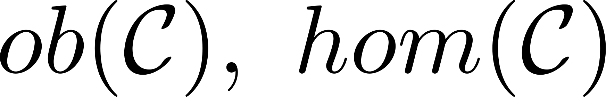

!SLIDE link
<h1 style="font-size: 7em">Faster jQuery 
with
 Category Theory</h1>
johnbender.github.com/presentation-faster-js

!SLIDE bullets mono-bullets
## me
* @johnbender
* johnbender.us
* github.com/johnbender

!SLIDE center adobe-background background-image
## jquery mobile

!SLIDE center adobe-background background-image
## rubyists
#### kstewart.me/2012/04/21/ruby-at-adobe.html

!SLIDE image center
# Motivation

!SLIDE center awesome-background background-image
<h2 class="over-image" style="margin-top: 35%;">math: it's great</h2>

!SLIDE image center stats-background background-image
<h2 class="over-image" style="margin-top: 35%;">jquery: it's popular</h2>

!SLIDE center speed-background background-image
<h2 class="over-image" style="margin-top: 35%;">speed: it's sexy</h2>

!SLIDE
## method chains

!SLIDE
<pre class="xsmall">
jQuery( "div" )
  .hide()
  .addClass( "foo" )
  .show();
</pre>

!SLIDE
<pre class="xsmall">
jQuery( "div" )
  <b>.hide()</b>
  .addClass( "foo" )
  .show();
</pre>

!SLIDE

<code>$( "div" ).hide();</code>

<pre class="medium">
var $divs = $( "div" );

$divs.map(function( i, elem ) {
  <b>elem.setAttribute( "style", "display: none;" );</b>
  return elem;
});
</pre>

!SLIDE
<pre class="xsmall">
jQuery( "div" )
  .hide()
  <b>.addClass( "foo" )</b>
  .show();
</pre>

!SLIDE

<code>$( "div" ).addClass( "foo" );</code>

<pre>
$divs.map(function( i, elem ) {
  <b>elem.setAttribute( "class", "foo" );</b>
  return elem;
});
</pre>

!SLIDE
<pre class="xsmall">
jQuery( "div" )
  .hide()
  .addClass( "foo" )
  <b>.show();</b>
</pre>

!SLIDE

<code>$( "div" ).show();</code>

<pre class="medium">
$divs.map(function( i, elem ) {
  <b>elem.setAttribute( "style", "display: block;" );</b>
  return elem;
});
</pre>

!SLIDE
<pre class="xsmall">
jQuery( "div" )
  <b>.hide()</b>
  <b>.addClass( "foo" )</b>
  <b>.show();</b>
</pre>

!SLIDE

<code>$( "div" ).hide().addClass( "foo" ).show();</code>

<pre class="medium">
$divs.map(function( i, elem ) {
  elem.setAttribute( "style", "display: none;" );
  elem.setAttribute( "class", "foo" );
  elem.setAttribute( "style", "display: block;" );
  return elem;
});</pre>

!SLIDE

<code>$( "div" ).hide().addClass( "foo" ).show();</code>

<pre class="medium">
$divs.map(function( i, elem ) {
  elem.setAttribute( "style", "display: none;" );
  elem.setAttribute( "class", "foo" );
  elem.setAttribute( "style", "display: block;" );
  return elem;
});</pre>

☹☹

!SLIDE
# Category Theory

!SLIDE center background-image e-ml-background
<h2 class="over-image"  style="margin-top: 35%;">context: it's useful</h2>
.notes Samuel Eilenberg and Saunders Mac Lane

!SLIDE center background-image e-ml-background
<h2 class="over-image"  style="margin-top: 35%; min-height: 96px;">
  Eilenberg
  Mac Lane
</h2>
.notes Samuel Eilenberg and Saunders Mac Lane

!SLIDE
## category?

!SLIDE center image
</img>

!SLIDE center image
</img>

!SLIDE
<pre class="xxsmall">
function id( a ) {
  return a;
}
</pre>

!SLIDE center image
</img>

!SLIDE
<pre class="xsmall">
function cmps( f, g ) {
  return function( a ) {
    return f(g(a));
  };
}
</pre>

!SLIDE
<pre class="xsmall">
function cmps( <b>f, g</b> ) {
  return function( a ) {
    return f(g(a));
  };
}
</pre>

!SLIDE
<pre class="xsmall">
function cmps( f, g ) {
  return function( <b>a</b> ) {
    return f(g(<b>a</b>));
  };
}
</pre>

!SLIDE
<pre class="xsmall">
function cmps( f, g ) {
  return function( a ) {
    return f(<b>g(a)</b>);
  };
}
</pre>

!SLIDE
<pre class="xsmall">
function cmps( f, g ) {
  return function( a ) {
    return <b>f(g(a))</b>;
  };
}
</pre>

!SLIDE
## Html

!SLIDE center image
</img>

!SLIDE
<pre>
// {HTMLDivElement}
document.querySelector( "div#sample" );
</pre>

!SLIDE center image
</img>

!SLIDE
<pre>
// @param {HTMLElement} elem
// @returns {HTMLElement}
function( elem ) {
  return elem;
};

</pre>

!SLIDE
<pre>
// @param {HTMLElement} elem
// @returns {HTMLElement}
function setFoo( elem ) {
  elem.setAttribute( "class", "foo" );
  return elem;
}
</pre>

!SLIDE center image
</img>

!SLIDE
<pre class="xsmall">
function id( a ) {
  return a;
}
</pre>

!SLIDE
<pre class="xsmall">
function id( <b>a</b> ) {
  return <b>a</b>;
}
</pre>

!SLIDE
<pre class="xsmall">
function id( <b>elem</b> ) {
  return <b>elem</b>;
}
</pre>

!SLIDE center image
</img>

!SLIDE
<pre class="xsmall">
function cmps( f, g ) {
  return function(a) {
    return f(g(a));
  };
}
</pre>

!SLIDE
<pre class="xsmall">
function cmps( f, g ) {
  return function(<b>a</b>) {
    return f(g(<b>a</b>));
  };
}
</pre>

!SLIDE
<pre class="xsmall">
function cmps( f, g ) {
  return function(<b>elem</b>) {
    return f(g(<b>elem</b>));
  };
}
</pre>

!SLIDE
## Jqry

!SLIDE center image
</img>

!SLIDE
<pre class="xsmall">
// {jQuery}
$( "#sample" );
</pre>

!SLIDE center image
</img>

!SLIDE
<pre class="xsmall">
// {jQuery}
$( "#sample" )<b>.hide();</b>
</pre>

!SLIDE center image
</img>

!SLIDE
<pre class="small">
// @returns {jQuery}
jQuery.fn.id = function() {
  return this;
};
</pre>

!SLIDE
<pre class="small">
// @returns {jQuery}
<b>jQuery.fn</b>.id = function() {
  return this;
};
</pre>

!SLIDE
<pre class="small">
// @returns {jQuery}
jQuery.fn.id = function() {
  return <b>this</b>;
};
</pre>

!SLIDE
<pre class="xsmall">
// {jQuery}
$( "#sample" ).id();
</pre>

!SLIDE
<pre class="xsmall">
// {jQuery}
$( "#sample" )<b>.id()</b>;
</pre>

!SLIDE center image
</img>

!SLIDE
<pre style="font-size: 3.6em;">
jQuery.cmps = function( f, g ) {
  return function() {
    return f.apply(g.apply(this));
  };
};
</pre>

!SLIDE
<pre style="font-size: 3.6em;">
jQuery.cmps = function( <b>f, g</b> ) {
  return function() {
    return f.apply(g.apply(this));
  };
};
</pre>

!SLIDE
<pre style="font-size: 3.6em;">
jQuery.cmps = function( f, g ) {
  return function() {
    return f.apply(g.apply(<b>this</b>));
  };
};
</pre>

!SLIDE
<pre style="font-size: 3.6em;">
jQuery.cmps = function( f, g ) {
  return function() {
    return f.apply(<b>g.apply(this)</b>);
  };
};
</pre>

!SLIDE
<pre style="font-size: 3.6em;">
jQuery.cmps = function( f, g ) {
  return function() {
    return <b>f.apply(g.apply(this))</b>;
  };
};
</pre>

!SLIDE
<pre>
// @returns {jQuery}
var g = jQuery.fn.g = function() {
  // manipulate `this`
  return this;
};

// @returns {jQuery}
var f = jQuery.fn.f = function(){
  // manipulate `this`
  return this;
};
</pre>

!SLIDE
<pre>
// @returns {jQuery}
var <b>g</b> = <b>jQuery.fn.g</b> = function() {
  // manipulate `this`
  return this;
};

// @returns {jQuery}
var <b>f</b> = <b>jQuery.fn.f</b> = function(){
  // manipulate `this`
  return this;
};
</pre>

!SLIDE
<pre>
// @returns {jQuery}
var g = jQuery.fn.g = function() {
  // manipulate `this`
  return <b>this</b>;
};

// @returns {jQuery}
var f = jQuery.fn.f = function(){
  // manipulate `this`
  return <b>this</b>;
};
</pre>

!SLIDE
<pre>
// @returns {jQuery}
jQuery.fn.gf = jQuery.cmps( f, g );

// {jQuery}
$( "#sample" ).g().f();

// {jQuery}
$( "#sample" ).gf();
</pre>

!SLIDE
<pre>
// @returns {jQuery}
jQuery.fn.gf = jQuery.cmps( <b>f, g</b> );

// {jQuery}
$( "#sample" ).g().f();

// {jQuery}
$( "#sample" ).gf();
</pre>

!SLIDE
<pre>
// @returns {jQuery}
jQuery.fn<b>.gf</b> = jQuery.cmps( f, g );

// {jQuery}
$( "#sample" ).g().f();

// {jQuery}
$( "#sample" ).gf();
</pre>

!SLIDE
<pre>
// @returns {jQuery}
jQuery.fn.gf = jQuery.cmps( f, g );

// {jQuery}
$( "#sample" )<b>.g().f()</b>;

// {jQuery}
$( "#sample" )<b>.gf()</b>;
</pre>

!SLIDE center background-image
## functor

!SLIDE center image
</img>

!SLIDE center image
</img>

!SLIDE center image
</img>

!SLIDE
<pre>
// {HTMLDivElement}
document.querySelector( "div" );
</pre>

!SLIDE
<pre>
// {jQuery}
$( document.querySelector("div") );
</pre>

!SLIDE center image
</img>

!SLIDE
<pre style="padding-left: 50px;">
function setFoo( elem ) {
  elem.setAttribute( "class", "foo" );
  return elem;
}

</pre>

!SLIDE
<pre style="padding-left: 50px;">
function setFoo( elem ) {
  elem.setAttribute( "class", "foo" );
  return elem;
}
</pre>

↓

<pre style="margin-top: 215px; padding-left: 200px;">
$( "div" ).setFoo();
</pre>

!SLIDE
<pre>
jQuery.map( $("div"), function( elem ) {
  elem.setAttribute( "class", "foo" );
  return elem;
});
</pre>

!SLIDE
<pre>
<b>jQuery.map</b>( $("div"), function( elem ) {
  elem.setAttribute( "class", "foo" );
  return elem;
});
</pre>

!SLIDE center
</img>
<pre style="font-size: 7em; color: #111">
$()
</pre>

!SLIDE center
</img>
<pre style="font-size: 7em; color: #111">
jQuery.map()
</pre>

!SLIDE
### composition

!SLIDE center image
</img>

!SLIDE center
<pre class="small">
$( "div" ).map(g).map(f)
==
$( "div" ).map( cmps(f, g) )
</pre>

!SLIDE center
<pre class="small">
$( "div" ).<b>map(g).map(f)</b>
==
$( "div" ).map( cmps(f, g) )
</pre>

!SLIDE center
<pre class="small">
$( "div" ).<b>map(g).map(f)</b>
==
$( "div" ).<b>map( cmps(f, g) )</b>
</pre>

!SLIDE
<pre>
$.fn.F = function(){
  return this.map(f);
};

$.fn.G = function(){
  return this.map(g);
};
</pre>

!SLIDE center
<pre class="small">
$( "div" ).<b>G().F()</b>
==
$( "div" ).map( cmps(f, g) )
</pre>

!SLIDE center
<pre class="small">
$( "div" ).<b>G().F()</b>
==
$( "div" ).<b>map( cmps(f, g) )</b>
</pre>

!SLIDE
## enlightenment

!SLIDE
<pre class="xsmall">
jQuery( "div" )
  .hide()
  .addClass( "foo" )
  .show();
</pre>

!SLIDE
<pre class="xsmall">
jQuery( "div" )
  <b>.hide()</b>
  .addClass( "foo" )
  .show();
</pre>

!SLIDE
<pre class="xsmall">
jQuery( "div" )
  .addClass( "foo" )
  .show();
</pre>

!SLIDE
<pre class="xsmall">
jQuery( "div" )
  <b>.addClass( "foo" )</b>
  <b>.show();</b>
</pre>

!SLIDE

<code>$( "div" ).addClass( "foo" ).show();</code>

<pre class="large">
$divs.map(function( i, elem ) {
  elem.setAttribute( "class", "foo" );
  return elem;
});

$divs.map(function( i, elem ) {
  elem.setAttribute( "style", "display: block;" );
  return elem;
});
</pre>

!SLIDE

<code>$( "div" ).addClass( "foo" ).show();</code>

<pre class="large">
$divs.map(function( i, elem ) {
  <b>elem.setAttribute( "class", "foo" );</b>
  return elem;
});

$divs.map(function( i, elem ) {
  <b>elem.setAttribute( "style", "display: block;" );</b>
  return elem;
});
</pre>

!SLIDE

<code>$( "div" ).addClass( "foo" ).show();</code>

<pre class="large">
$divs.map(function( i, elem ) {
  <b>elem.setAttribute( "class", "foo" );</b>
  <b>elem.setAttribute( "style", "display: block;" );</b>
  return elem;
});
</pre>

!SLIDE

<code>$( "div" ).addClass( "foo" ).show();</code>

<pre class="large">
$divs.map(function( i, elem ) {
  <b>elem.setAttribute( "class", "foo" );</b>
  <b>elem.setAttribute( "style", "display: block;" );</b>
  return elem;
});
</pre>

☹☹

!SLIDE

<code>$( "div" ).addClass( "foo" ).show();</code>

<pre class="large">
$divs.map(function( i, elem ) {
  elem.setAttribute( "class", "foo" );
  return elem;
});

$divs.map(function( i, elem ) {
  elem.setAttribute( "style", "display: block;" );
  return elem;
});
</pre>

!SLIDE

<code>$( "div" ).addClass( "foo" ).show();</code>

<pre class="large">
function g( i, elem ) {
  elem.setAttribute( "class", "foo" );
  return elem;
};

function f( i, elem ) {
  elem.setAttribute( "style", "display: block;" );
  return elem;
};
</pre>

!SLIDE

<code>$( "div" ).addClass( "foo" ).show();</code>

<pre class="large">
$divs.map(function( i, elem ) {
  elem.setAttribute( "class", "foo" );
  elem.setAttribute( "style", "display: block;" );
  return elem;
});
</pre>

↓

<pre class="large" style="text-align: center; margin-top: 200px">
$divs.map( cmps(f, g) );
</pre>

!SLIDE

<code>$( "div" ).addClass( "foo" ).show();</code>

<pre class="large">
$divs.map(function( i, elem ) {
  elem.setAttribute( "class", "foo" );
  elem.setAttribute( "style", "display: block;" );
  return elem;
});
</pre>

↓

<pre class="large" style="text-align: center; margin-top: 200px">
$divs.map( <b>cmps(f, g)</b> );
</pre>

!SLIDE

<code>$( "div" ).addClass( "foo" ).show();</code>

<pre class="large">
$divs.map(function( i, elem ) {
  elem.setAttribute( "class", "foo" );
  elem.setAttribute( "style", "display: block;" );
  return elem;
});
</pre>

↓

<pre class="large" style="text-align: center; margin-top: 200px">
$divs.map( <b>cmps(f, g)</b> );
</pre>

☺☺

!SLIDE
# Meanwhile

!SLIDE center background-image facepalm-background
<h2 class="over-image" style="margin-top: 35%;">timing: it's everything</h2>

!SLIDE
## standard

!SLIDE center
<pre style="font-size: 8em">$.fn.addClass</pre>

!SLIDE

<code>$( "div" ).addClass( "foo" );</code>

<pre>
$.fn.addClass = function(){
  return this.map(function( elem ) {
    elem.setAttribute( "class", "foo" );
    return elem;
  });
};
</pre>

!SLIDE

<code>$( "div" ).addClass( "foo" );</code>

<pre>
$.fn.addClass = function(){
  return this.map(<b>function</b>( elem ) {
    elem.setAttribute( "class", "foo" );
    return elem;
  });
};
</pre>

!SLIDE
<pre>
function addClass( i, elem ) {
  elem.setAttribute( "class", "foo" );
  return elem;
};
</pre>

!SLIDE

<code>$( "div" ).addClass( "foo" );</code>

<pre class="small">
$.fn.addClass = function(){
  return this.map(addClass);
};
</pre>

!SLIDE
<pre>
$.fn.addClass.composable = addClass;
</pre>

!SLIDE
<pre>
$.fn.addClass.<b>composable</b> = addClass;
</pre>

!SLIDE
## sample

!SLIDE
<pre>
$( "div" ).addClass( "foo" ).show();
</pre>

!SLIDE
<pre class="small">
$.fn.addClass = function(){
  return this.map(addClass);
};
</pre>

<pre class="small">
$.fn.show = function(){
  return this.map(show);
};
</pre>

!SLIDE

<pre class="small">
$.fn.addClass = function(){
  return this.map(<b>addClass</b>);
};
</pre>

<pre class="small">
$.fn.show = function(){
  return this.map(<b>show</b>);
};
</pre>

!SLIDE

<code>$( "div" ).addClass( "foo" ).show();</code>

<pre class="small">
$( "div" ).map(
  $.fn.show.composable,
  $.fn.addClass.composable
);
</pre>

!SLIDE

<code>$( "div" ).addClass( "foo" ).show();</code>

<pre class="small">
$( "div" ).map(
  <b>$.fn.show.composable</b>,
  <b>$.fn.addClass.composable</b>
);
</pre>

!SLIDE
## simple helper

!SLIDE
<pre>
$.fn.compose = function( f, g ) {
  if( f.composable &amp;&amp; g.composable ){
    return this.map( cmps( f, g) );
  }

  throw "Oops!";
};
</pre>

!SLIDE
<pre>
$.fn.compose = function( f, g ) {
  if( <b>f.composable &amp;&amp; g.composable</b> ){
    return this.map( cmps( f, g) );
  }

  throw "Oops!";
};
</pre>

!SLIDE
<pre>
$.fn.compose = function( f, g ) {
  if( f.composable &amp;&amp; g.composable ){
    return this.map( <b>cmps( f, g)</b> );
  }

  throw "Oops!";
};
</pre>

!SLIDE

<code>$( "div" ).addClass( "foo" ).show();</code>

<pre class="xsmall">
$( "div" ).compose(
  $.fn.show,
  $.fn.addClass
);</pre>

!SLIDE
### github
github.com/johnbender/jquery-lazy-proxy

!SLIDE center
# Reading

johnbender.us/2012/02/29/faster-javascript-through-category-theory

johnbender.us/2012/03/22/a-natural-transformation-in-javascript

!SLIDE bullets mono-bullets>
# Thanks
* @johnbender
* johnbender.us
* github.com/johnbender
